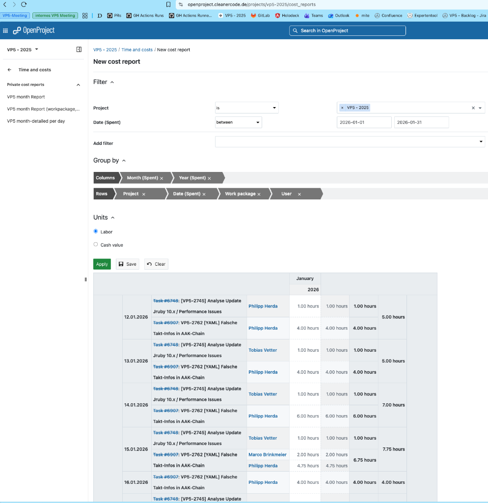

# OpenProject Report Converter

Konvertiert OpenProject XLS Cost Reports in das Google Sheets Format für VP5-2025 Reports.

> 📖 **Vollständige Anleitung:** Siehe [SOP.md](SOP.md) für detaillierte Schritt-für-Schritt Anweisungen

---

## 📋 Was macht das Tool?

Das Tool konvertiert OpenProject-Exporte von diesem Format:

### Vorher: OpenProject Cost Report



**Quelle:** https://openproject.cleanercode.de/projects/vp5-2025/cost_reports/4

- ❌ Einzelne Zeiteinträge pro User/Task
- ❌ 9 Spalten mit vielen redundanten Informationen
- ❌ Task-IDs versteckt in langen Beschreibungen

### Nachher: Google Sheets Format

**Ziel:** https://docs.google.com/spreadsheets/d/11UM8dUUrX7ZRyeexesznITPOmnk3EtOBpUB1RoFVNjc/edit

- ✅ **Spalte A**: Projekt (VP5 - 2025)
- ✅ **Spalte B**: Datum (YYYY-MM-DD)
- ✅ **Spalte C**: Stunden (Summe pro Tag)
- ✅ **Spalte D**: Task-IDs (z.B. "VP5-2745, VP5-2762")
- ✅ **Spalte E**: Manuelle Korrektur (editierbar, enthält Original-Stunden)

---

## 🚀 Quick Start

```bash
# 1. Navigiere zum Projekt-Verzeichnis
cd /Users/marcobrinkmeier/projects/vp5_reports

# 2. Konvertiere die XLS-Datei
python3.11 convert_openproject_report.py <dateiname.xls>

# 3. Importiere converted_report.csv in Google Sheets
```

---

## 📝 Vollständiger Workflow

### 1. OpenProject Report exportieren

1. Öffne OpenProject Cost Reports: https://openproject.cleanercode.de/projects/vp5-2025/cost_reports/4
2. Konfiguriere Filter:
   - **Project:** VP5 - 2025
   - **Date (Spent):** between → Wähle Zeitraum
3. Konfiguriere Gruppierung:
   - **Columns:** Month (Spent), Year (Spent)
   - **Rows:** Project, Date (Spent), Work package, User
4. **Units:** Labor ☑
5. Klicke "Apply" → "Save" → Wähle "XLS"
6. Verschiebe Datei:
   ```bash
   mv ~/Downloads/cost-report-*.xls ~/projects/vp5_reports/
   ```

### 2. Konvertierung ausführen

```bash
cd ~/projects/vp5_reports
python3.11 convert_openproject_report.py <dateiname.xls>
```

**Erwartete Ausgabe:**
```
📖 Lese Datei: cost-report-2026-02-02-T-11-34-4120260202-7-p8jkg3.xls
✅ 26 Einträge geladen
📊 12 Tage gruppiert

Vorschau:
   Projekt      Datum  Stunden (Summe)           Task-IDs  Manuelle Korrektur
VP5 - 2025 2026-01-12             5.00 VP5-2745, VP5-2762                   5
VP5 - 2025 2026-01-13             5.00 VP5-2745, VP5-2762                   5
...

✅ Konvertierung abgeschlossen!
📁 Ausgabe: converted_report.csv
```

### 3. Import in Google Sheets

1. Öffne: https://docs.google.com/spreadsheets/d/11UM8dUUrX7ZRyeexesznITPOmnk3EtOBpUB1RoFVNjc/edit
2. **Datei** → **Importieren** → **Upload**
3. Wähle `converted_report.csv`
4. **Importort:** "Daten ersetzen" oder "Neues Tabellenblatt"
5. Klicke "Daten importieren"

### 4. Manuelle Korrektur

- Spalte E enthält die Original-Stunden
- Passe Werte nach Bedarf an (z.B. auf 8h für Vollzeit-Tage)
- Fertig! 🎉

---

## 📊 Beispiel-Output

### Input (OpenProject XLS)
```
Date (Spent) | User          | Activity    | Logged for                    | Units
-------------|---------------|-------------|-------------------------------|------
2026-01-12   | Philipp Herda | -           | Task #6748: [VP5-2745]...     | 1
2026-01-12   | Tobias Vetter | Development | Task #6907: VP5-2762...       | 4
```

### Output (Google Sheets CSV)
```
Projekt      | Datum      | Stunden (Summe) | Task-IDs           | Manuelle Korrektur
-------------|------------|-----------------|--------------------|-----------------
VP5 - 2025   | 2026-01-12 | 5.0             | VP5-2745, VP5-2762 | 5
```

---

## 🔧 Features

| Feature | Status |
|---------|--------|
| XLS Import | ✅ |
| Datum-Gruppierung | ✅ |
| Stunden-Summierung | ✅ |
| Task-ID Extraktion (VP5-XXXX) | ✅ |
| Duplikat-Entfernung | ✅ |
| CSV Export (UTF-8) | ✅ |
| Manuelle Korrektur-Spalte | ✅ |
| Sortierung nach Datum | ✅ |

---

## 📦 Installation & Abhängigkeiten

```bash
# Python-Pakete installieren
pip3 install pandas openpyxl xlrd
```

**Voraussetzungen:**
- Python 3.11 oder höher
- Zugriff auf OpenProject (VP5-2025 Projekt)
- Zugriff auf Google Sheets

---

## 🐛 Troubleshooting

| Problem | Lösung |
|---------|--------|
| **"No module named 'pandas'"** | `pip3 install pandas openpyxl xlrd` |
| **"File not found"** | Überprüfe Dateinamen und Pfad |
| **Keine Task-IDs extrahiert** | Task-Beschreibungen müssen "VP5-XXXX" Format enthalten |
| **Falsche Stunden-Summen** | Überprüfe OpenProject Filter-Einstellungen |

---

## 📚 Dokumentation

- **[SOP.md](SOP.md)** - Vollständige Standard Operating Procedure
- **[convert_openproject_report.py](convert_openproject_report.py)** - Haupt-Skript
- **OpenProject:** https://openproject.cleanercode.de/projects/vp5-2025/cost_reports/4
- **Google Sheets:** https://docs.google.com/spreadsheets/d/11UM8dUUrX7ZRyeexesznITPOmnk3EtOBpUB1RoFVNjc/edit

---

## 💡 Tipps

- **Mehrere Projekte:** Das Skript gruppiert automatisch nach Projekt
- **Task-IDs:** Werden automatisch aus der "Logged for" Spalte extrahiert
- **Manuelle Korrektur:** Enthält Original-Stunden, kann in Google Sheets angepasst werden
- **Automatisierung:** Erstelle einen Bash-Alias für schnelleren Zugriff (siehe SOP)

---

## � Nächste Schritte

Nach dem Import in Google Sheets:
1. ✅ Überprüfe die Stunden-Summen
2. ✅ Passe Spalte E (Manuelle Korrektur) an
3. ✅ Archiviere die XLS-Datei (optional)
4. 🎉 Fertig!
